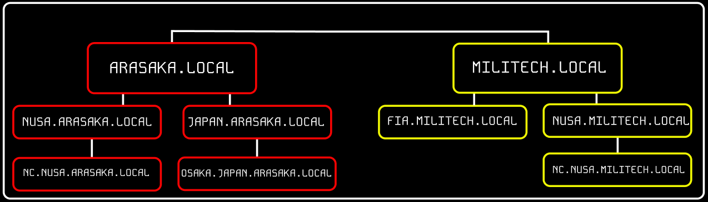

# Theory

## <mark style="color:yellow;">What is Active Directory</mark>

<mark style="color:red;">**Active Directory (AD)**</mark> is a <mark style="color:purple;">**directory service**</mark> developed by **Microsoft** for Windows domain networks. It is included in most Windows Server operating systems as a set of processes and services. Active Directory plays a crucial role in managing the identities and relationships that make up network environments.&#x20;

#### <mark style="color:blue;">Key Concepts of Active Directory</mark>

* <mark style="color:red;">**Domain**</mark><mark style="color:red;">:</mark> The basic unit of structure in an Active Directory network. A domain is a collection of objects such as users, groups, and computers that are managed centrally.
* <mark style="color:red;">**Forest**</mark><mark style="color:red;">:</mark> A collection of one or more domain trees. Forests enable global policies and trust relationships across multiple domains.
* <mark style="color:red;">**Tree**</mark><mark style="color:red;">:</mark> A hierarchy of domains in Active Directory that share a contiguous namespace.
* <mark style="color:red;">**Organizational Unit (OU)**</mark><mark style="color:red;">:</mark> A container within a domain that can hold users, groups, computers, and other OUs. OUs allow the organization of objects within a domain and the application of policies at a granular level.
* <mark style="color:red;">**Global Catalog**</mark><mark style="color:red;">:</mark> A distributed data repository that contains a searchable, partial representation of every object in every domain within a forest. It is used to improve query performance and facilitate logon processes across domains.

After Windows system became part of the domain, it's interaction with SAM is over, they've broke up and it's new boyfriend is Domain Controller. And all questions about checking password would now be sent to Domain Controller, not SAM.  But in some ways system could come over to SAM if specify the <mark style="color:green;">`hostname`</mark> of the device proceeded by the <mark style="color:green;">`username`</mark> like <mark style="color:blue;">**WS01/nameofuser**</mark>**.**&#x20;

## <mark style="color:yellow;">STRUCTURE EXAMPLE</mark>

<pre class="language-scheme"><code class="lang-scheme"><strong>FIA.LOCAL/
</strong>├── FIELD-AGENTS.INLANEFREIGHT.LOCAL
│   ├── GPOs
│   └── OU
│       └── EMPLOYEES
│           ├── COMPUTERS
│           │   └── PC01
│           ├── GROUPS
│           │   └── SQUAD01
│           └── AGENTS
│               ├── solomon.reed
│               ├── alex.xenakis
│               └── song.so.mi
├── CORP.INLANEFREIGHT.LOCAL
└── EXEC.INLANEFREIGHT.LOCAL
</code></pre>

<figure><figcaption>
Made in Figma
</figcaption></figure>

Here we could see domain structure of <mark style="color:red;">**`ARASAKA.LOCAL`**</mark> and <mark style="color:yellow;">**`MILITECH.LOCAL`**</mark>. Let's imagine that **ARASAKA** and **MILITECH** have bidirectional trust between these forests, meaning that users from <mark style="color:red;">**`ARASAKA.LOCAL`**</mark> can access <mark style="color:yellow;">**`MILITECH.LOCAL`**</mark>.&#x20;

We can also see multiple child domains under each root domain. In this example, we can see that the root domain trusts each of the child domains, but the child domains in <mark style="color:red;">**`ARASAKA.LOCAL`**</mark> do not necessarily have trusts established with the child domains in <mark style="color:yellow;">**`MILITECH.LOCAL`**</mark>. This means that a user that is part of <mark style="color:red;">**`OSAKA.JAPAN.ARASAKA.LOCAL`**</mark> would NOT be able to authenticate to machines in the <mark style="color:yellow;">**`NC.NUSA.MILITECH.LOCAL`**</mark> domain by default even though a bidirectional trust exists between the top-level <mark style="color:yellow;">**`MILITECH.LOCAL`**</mark> and <mark style="color:red;">**`ARASAKA.LOCAL`**</mark> domains.

## <mark style="color:yellow;">KERBEROS</mark>

<mark style="color:red;">**Kerberos**</mark> is default domain accounts <mark style="color:purple;">**authentication protocol**</mark> since **Windows 2000**. Main difference between other authentication protocols is that **Kerberos** use tickets, instead of just transmitting passwords all over the network. This image will show you simplified version of **Kerberos** authentication process, and then I'll explain everything in parts. Also for more detailed explanations I could recommend to watch [**\[THIS\]**](https://youtu.be/5N242XcKAsM?t=870) video.

<figure><figcaption></figcaption></figure>

The whole **ping-pong** of tickets and requests is shows here:

<figure><figcaption>
Image is from video above
</figcaption></figure>

### <mark style="color:blue;">Main Kerberos Terms</mark>

*   <mark style="color:red;">**Key Distribution Center (KDC)**</mark><mark style="color:red;">:</mark>

    Core of **Kerberos** authentication that manages secret keys and distributes them to clients and servers. It is divided into two main components: the <mark style="color:red;">**Authentication Server (AS)**</mark> and the <mark style="color:red;">**Ticket Granting Server (TGS)**</mark>.
*   <mark style="color:red;">**Authentication Server (AS)**</mark><mark style="color:red;">:</mark>

    Part of the **KDC** that verifies the identity of the client. Upon successful authentication, it issues a <mark style="color:red;">**Ticket Granting Ticket (TGT)**</mark> to the client, which can be used to request service tickets from the **TGS**. There are also database with hashes of user credentials.
*   <mark style="color:red;">**Ticket Granting Server (TGS)**</mark><mark style="color:red;">:</mark>

    Part of the **KDC** that issues service tickets to clients that have a valid **TGT**. These service tickets allow the client to authenticate to various services without needing to re-enter their credentials. There are also database with service secret keys, which is used to <mark style="color:green;">**encrypt/decrypt**</mark> **service tickets**.
*   <mark style="color:red;">**Ticket Granting Ticket (TGT)**</mark><mark style="color:red;">:</mark>

    Ticket given by the **AS** to a client upon successful authentication. It contains a session key and is used to obtain service tickets from the **TGS**. The **TGT** is encrypted with the **TGS's** secret key.
* <mark style="color:red;">**Service Ticket:**</mark> \
  This **Ticket** allows a client to authenticate to a specific service. It contains encrypted information that verifies the client's identity and includes a session key that the client can use to communicate securely with the service.

## <mark style="color:yellow;">NTLM</mark>

<mark style="color:red;">**NTLM (NT LAN Manager)**</mark> is a challenge-response <mark style="color:purple;">**authentication protocol**</mark> developed by Microsoft for authenticating users and securing communication in Windows environments. It has been largely replaced by **Kerberos** in modern Active Directory (AD) environments but is still present for backward compatibility.

#### How it works?

NTLM uses a challenge-response mechanism to authenticate users without transmitting their passwords in plaintext.

1. <mark style="color:blue;">**User Requests Access**</mark>
   * The client (user) tries to authenticate to a server or domain controller.
2. <mark style="color:blue;">**Challenge from the Server**</mark>
   * The server sends a random **nonce (challenge)** to the client.
3. <mark style="color:blue;">**Client Responds with a Hash**</mark>
   * The client encrypts the challenge using an NTLM hash (derived from the user's password) and sends it back.
4. <mark style="color:blue;">**Server Verifies**</mark>
   * The server compares the response with its expected hash (computed from the stored user credentials).

## <mark style="color:yellow;">NTDS.DIT</mark>

<mark style="color:red;">**NTDS.DIT**</mark> stands for <mark style="color:red;">**New Technology Directory Services Directory Information Tree**</mark>. It is main <mark style="color:purple;">**database file**</mark> within Microsoft’s **Active Directory Domain Services** **(AD DS)**. **NTDS.DIT** stores and organizes all the information related to objects in the domain, including **users**, **groups**, **computers**, and more. It acts as the backbone of Active Directory, housing critical data such as **user account details**, **passwords**, **group memberships**, and other **object attributes**.

## <mark style="color:yellow;">LDAP</mark>

<mark style="color:red;">**LDAP (Lightweight Directory Access Protocol)**</mark> is a protocol used to access and manage directory services over a network. It stores information in a hierarchical structure and is often used for user authentication, authorization, and managing resources like contacts or network devices. LDAP allows operations like searching, adding, modifying, and deleting directory entries. It's commonly used in systems like Microsoft Active Directory for managing user data and permissions.

## <mark style="color:yellow;">TRUST</mark>

<mark style="color:red;">**Trust**</mark> enables authentication between forests or domains, allowing users to access resources or manage another domain outside their own. <mark style="color:purple;">**It establishes a connection between the authentication systems of the two domains.**</mark>

| **Trust Type**                                   | **Description**                                                                                                                                                                                                               |
| ------------------------------------------------ | ----------------------------------------------------------------------------------------------------------------------------------------------------------------------------------------------------------------------------- |
| <mark style="color:red;">**Parent-child**</mark> | <mark style="color:purple;">**A trust between domains within the same forest**</mark>, where the child domain automatically forms a two-way transitive trust with its parent domain.                                          |
| <mark style="color:red;">**Cross-link**</mark>   | <mark style="color:purple;">**A direct trust between child domains**</mark> designed to optimize authentication processes.                                                                                                    |
| <mark style="color:red;">**External**</mark>     | <mark style="color:purple;">**A non-transitive trust between domains in separate forests**</mark> that are not connected by a forest trust. This type of trust employs SID filtering.                                         |
| <mark style="color:red;">**Tree-root**</mark>    | <mark style="color:purple;">**A two-way transitive trust between the root domain of a forest and a newly created tree root domain**</mark>. It is automatically established when a new tree root domain is added to a forest. |
| <mark style="color:red;">**Forest**</mark>       | <mark style="color:purple;">**A transitive trust between the root domains of two separate forests.**</mark>                                                                                                                   |

<figure><figcaption>
Image from <a href="https://academy.hackthebox.com/"><strong>HackTheBox</strong></a>
</figcaption></figure>

Trusts can be <mark style="color:red;">**transitive**</mark> or <mark style="color:red;">**non-transitive**</mark>.

* A **transitive** trust means that trust is extended to objects that the child domain trusts.
* In a **non-transitive** trust, only the child domain itself is trusted.

Also they can be one-way, and bidirectional. Here everything is quite obvious, one-way is one way and bidirectional can work in both-ways, back and forward.

## <mark style="color:yellow;">GROUPS</mark>

In **Active Directory (AD)**, groups are used to <mark style="color:purple;">**manage permissions**</mark> and <mark style="color:purple;">**assign access**</mark> to users, computers, and other resources efficiently.

### <mark style="color:blue;">Group Types</mark>

* <mark style="color:red;">**Security Groups**</mark>
  * Used for **assigning permissions** to resources (e.g., file shares, printers).
  * Can be used for **Group Policy (GPO) applications**.
  * Example: _"_&#x49;T Admin&#x73;_"_ security group with admin access.
* <mark style="color:red;">**Distribution Groups**</mark>
  * Used for **email distribution lists** (e.g., Outlook groups).
  * **Cannot** be used for permissions.
  * Example: _"HR Team"_ email group for internal communication.

### <mark style="color:blue;">Group Scopes</mark>

Scopes define <mark style="color:purple;">**where the group is used**</mark> and <mark style="color:purple;">**who can be a member**</mark>.

| **Scope** | **Can Contain** | **Can Be Used In** |
| --------- | --------------- | ------------------ |

| **Domain Local** | Users, groups from **any domain** | **Local domain** only |
| ---------------- | --------------------------------- | --------------------- |

| **Global** | Users, groups from **same domain** | **Any trusted domain** |
| ---------- | ---------------------------------- | ---------------------- |

| **Universal** | Users, groups from **any domain** | **Forest-wide** |
| ------------- | --------------------------------- | --------------- |

## <mark style="color:yellow;">GPO</mark>

<mark style="color:red;">**Group Policy Object (GPO)**</mark> is a virtual collection of policy settings that can be applied to **user(s)** or **computer(s)**. Every GPO has a unique name and is assigned a unique identifier (a GUID). They can be linked to a specific OU, domain, or site. A single GPO can be linked to multiple containers, and any container can have multiple GPOs applied to it. They can be applied to individual users, hosts, or groups by being applied directly to an OU. Every GPO contains one or more Group Policy settings that may apply at the local machine level or within the Active Directory context.

#### Example

* Establishing different password policies for service accounts, admin accounts, and standard user accounts using separate GPOs
* Preventing the use of removable media devices (such as USB devices)
* Enforcing a screensaver with a password
* Restricting access to applications that a standard user may not need, such as cmd.exe and PowerShell
* Enforcing audit and logging policies
* Blocking users from running certain types of programs and scripts
* Deploying software across a domain
* Blocking users from installing unapproved software
* Displaying a logon banner whenever a user logs into a system
* Disallowing LM hash usage in the domain
* Running scripts when computers start/shutdown or when a user logs in/out of their machine

## <mark style="color:yellow;">ADCS</mark>

<mark style="color:red;">**Active Directory Certificate Services (AD CS)**</mark> is a **Windows Server&#x20;**<mark style="color:purple;">**role**</mark> for issuing and managing <mark style="color:red;">**public key infrastructure (PKI)**</mark> certificates used in secure communication and authentication protocols. So basically it is **PKI** framework functionality implementation in **AD** and **Windows Server**. As for hacker perspective, ADCS Certificates are giving us wider attack surface and it's usually not as monitored as Kerberos Tickets or Access Tokens. Also Kerberos Tickets usually exist not that long, when Certificates could be valid for months.

### <mark style="color:blue;">Flow</mark>

<figure><figcaption>
Image from <strong>HackingArticles</strong> <a href="https://www.hackingarticles.in/ad-certificate-exploitation-esc1/"><strong>[LINK]</strong></a>
</figcaption></figure>

### <mark style="color:blue;">CA</mark>

<mark style="color:red;">**Certificate Authority (CA)**</mark> in **Active Directory Certificate Services (AD CS)** is a <mark style="color:purple;">**trusted entity**</mark> responsible for issuing, managing, and validating digital certificates in an Active Directory environment. These digital certificates are used to verify identities, secure communications, and enable authentication across the network.

### <mark style="color:blue;">Cert Template</mark>

<mark style="color:red;">**Certificate Template**</mark> is a <mark style="color:purple;">**predefined configuration**</mark> in Microsoft AD CS that defines the type of certificate a user, computer, or service can request. It specifies parameters such as the intended purpose of the certificate, encryption algorithms, validity period, and whether it can be auto-enrolled.

These templates allow administrators to control the issuance and management of certificates within an organization’s Active Directory environment. AD CS uses these templates to standardize certificate issuance, thus making it easier to deploy secure certificates for users, computers, and services.

### <mark style="color:blue;">PKI</mark>

<mark style="color:red;">**PKI (Public Key Infrastructure)**</mark> is a <mark style="color:purple;">**framework**</mark> that provides the creation, distribution, management of digital certificates. It ensures secure communication over networks by authenticating users, devices, and services through the use of public and private key pairs.
