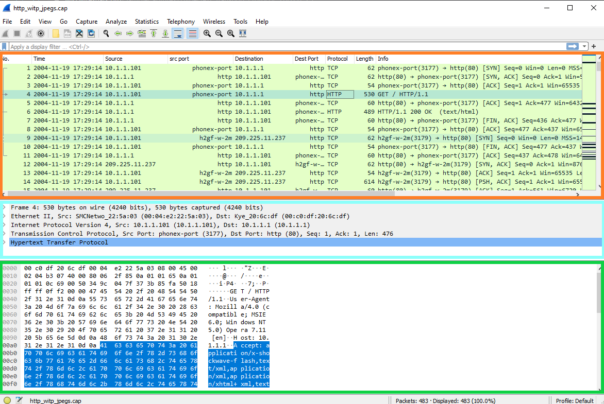
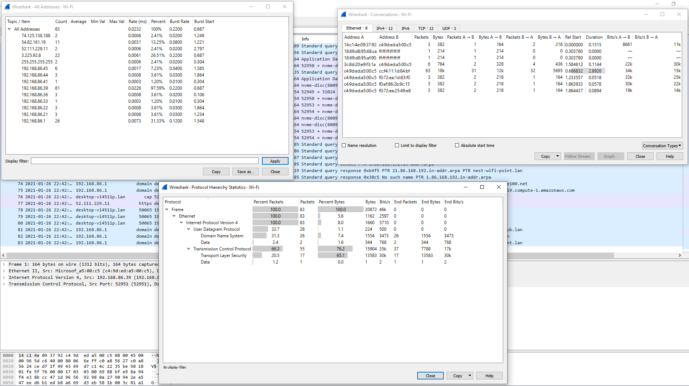
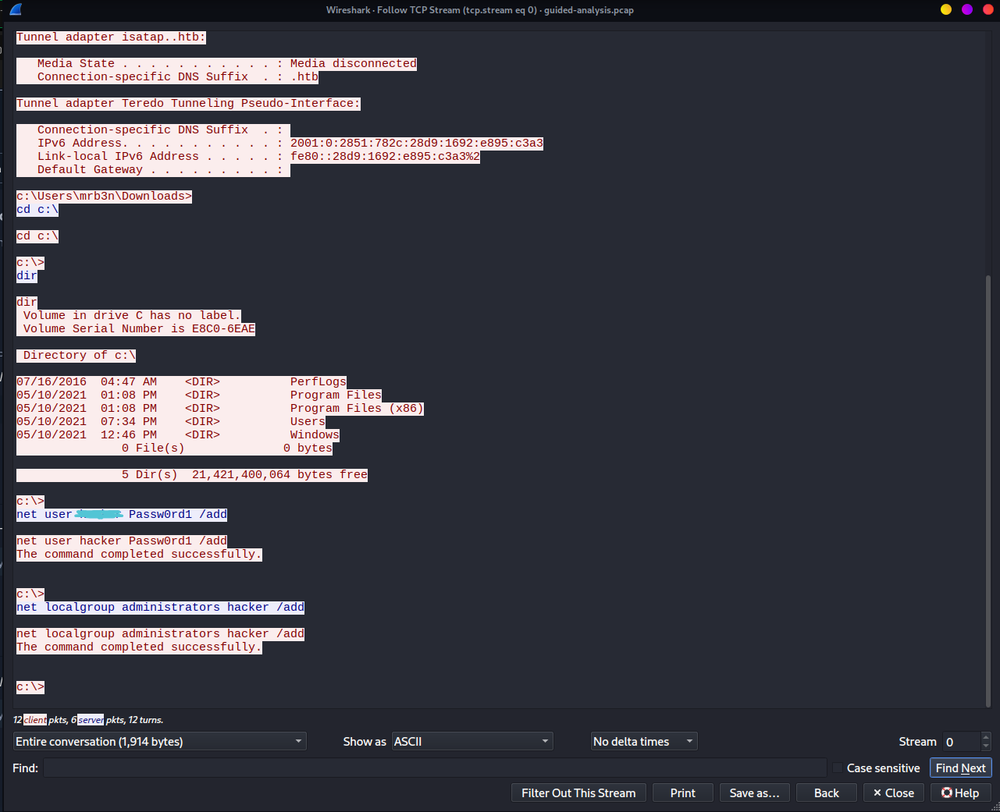

# Wireshark

## <mark style="color:yellow;">INTERFACE</mark>

<figure><figcaption></figcaption></figure>

<mark style="color:green;">**Orange**</mark> - Packet's List

<mark style="color:orange;">**Blue**</mark> - Packet's Details.&#x20;

<mark style="color:yellow;">**Keep in mind, Wireshark will show this encapsulation in reverse order with lower layer encapsulation at the top of the window and higher levels at the bottom.**</mark>

<mark style="color:blue;">**Green**</mark> - Packet's Bytes

## <mark style="color:yellow;">DISPLAY FILTERS</mark>

```bash
ip.addr == 13.13.13.13 	      # Capture only traffic pertaining to a certain host. This is an OR statement.
ip.addr == 13.13.13.13/24     # Capture traffic pertaining to a specific network. This is an OR statement.
ip.src/dst == 13.13.13.13     # Capture traffic to or from a specific host
dns / tcp / ftp / arp / ip    # Filter traffic by a specific protocol. There are many more options.
tcp.port == 20 	              # Filter by a specific tcp port.
tcp.port / udp.port != 20     # Will capture everything except the port specified
and / or / not 	              # AND will concatenate, OR will find either of two options, NOT will exclude your input option.
```

## <mark style="color:yellow;">CAPTURE FILTERS</mark>

```bash
host 13.13.13.13 	          # Capture only traffic pertaining to a certain host
net 13.13.13.13/24 	          # Capture traffic to or from a specific network (using slash notation to specify the mask)
src/dst net 13.13.13.13/24        # Using src or dst net will only capture traffic sourcing from the specified network or destined to the target network
port 20 	                  # will filter out all traffic except the port you specify
not port 20 	                  # will capture everything except the port specified
port 20 and 21 	                  # AND will concatenate your specified ports
portrange 20-1000 	          # portrange will grab traffic from all ports within the range only
ip / ether / tcp 	          # These filters will only grab traffic from specified protocol headers.
broadcast / multicast / unicast   # Grabs a specific type of traffic. one to one, one to many, or one to all.
```

<figure><figcaption></figcaption></figure>

## <mark style="color:yellow;">FEATURES</mark>

### <mark style="color:blue;">Statistics</mark>

<figure><figcaption></figcaption></figure>

### <mark style="color:blue;">TCP Streams</mark>

To check TCP Stream just click Right Mouse button on packet and click "Follow"

<figure><figcaption></figcaption></figure>

### <mark style="color:blue;">File Extraction</mark>

<figure><figcaption></figcaption></figure>
