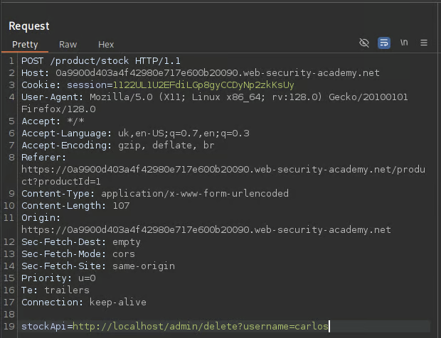

# OSI & TCP/IP Models

## <mark style="color:yellow;">OSI Model</mark>

<mark style="color:red;">**OSI (Open Systems Interconnection)**</mark> model is a conceptual <mark style="color:purple;">**framework**</mark> that standardizes the functions of a telecommunications or networking system into seven distinct layers:

1. <mark style="color:yellow;">**`Physical Layer`**</mark>: This layer deals with the physical medium and hardware aspects of data transmission, such as cables, switches, and electrical signals.
2. <mark style="color:yellow;">**`Data Link Layer`**</mark>: Responsible for the reliable transmission of data over a physical medium, it handles tasks like addressing, error detection, and framing.
3. <mark style="color:yellow;">**`Network Layer`**</mark>: Focuses on routing and forwarding data packets between different networks, often using logical addressing (like IP addresses).
4. <mark style="color:yellow;">**`Transport Layer`**</mark>: Ensures end-to-end data transfer reliability and provides services like flow control, error detection and correction, and data segmentation.
5. <mark style="color:yellow;">**`Session Layer`**</mark>: Manages the establishment, maintenance, and termination of communication sessions between devices, allowing for synchronization and organization of data exchange.
6. <mark style="color:yellow;">**`Presentation Layer`**</mark>: Responsible for data translation, encryption, and compression, making sure data is in a format that can be understood by both sender and receiver.
7. <mark style="color:yellow;">**`Application Layer`**</mark>: This is the topmost layer that interacts with end-user applications and provides network services like email, web browsing, and file transfer.

## <mark style="color:yellow;">TCP/IP</mark>

<mark style="color:red;">**TCP/IP (Transmission Control Protocol/Internet Protocol)**</mark> is a generic term for many network protocols, which is not only refer to these two protocols but is usually used as a generic term for an entire <mark style="color:purple;">**protocol family**</mark>. These protocols are responsible for the <mark style="color:yellow;">**switching and transport of data packets**</mark> on the Internet.&#x20;

1. <mark style="color:yellow;">**`Link`**</mark>: Places and retrieves packets on/from the network medium, regardless of format or method.
2. <mark style="color:yellow;">**`Internet`**</mark>: Handles addressing, packaging, and routing of data packets.
3. <mark style="color:yellow;">**`Transport`**</mark> : Manages sessions (TCP) and datagrams (UDP) for reliable communication.
4. <mark style="color:yellow;">**`Application`**</mark>: Enables applications to use network services and defines data exchange protocols.

## <mark style="color:yellow;">Packet Encapsulation</mark>

<mark style="color:red;">**Packet encapsulation**</mark> refers to the <mark style="color:purple;">**process of adding headers**</mark> to data as it moves through different layers of a network protocol stack. In both the OSI model and TCP/IP model, data is progressively encapsulated as it moves from the top to the bottom layers for transmission and then decapsulated at the receiving end.

### <mark style="color:blue;">Images</mark>

_But besides all explanations I think in this topic pictures are better explainers:_&#x20;

<figure><figcaption><p>Made in Figma</p></figcaption></figure>

<figure><figcaption><p>Encapsulation process</p></figcaption></figure>

<figure><figcaption><p>OSI vs TCP/IP</p></figcaption></figure>

## <mark style="color:yellow;">PDU</mark>

<mark style="color:red;">**PDU (Protocol Data Units)**</mark> is a <mark style="color:purple;">**data packet made up of control information**</mark> and data encapsulated from each layer of the OSI model. The breakout below will show how the layers in the two models match up to a PDU.

<figure><figcaption></figcaption></figure>

And here you'll see comparison of PDU's with real example of packet:

<figure><figcaption></figcaption></figure>

## <mark style="color:yellow;">ENCAPSULATION</mark>

Notice how **order** of PDU's have changed. That's because of <mark style="color:red;">**encapsulation**</mark> process. Imagine a post office, when before sending a package, we are packing it inside a few boxes, each of which has it's own unique required data. And as recipient gets the package, it unpacks it, layer by layer(<mark style="color:red;">**decapsulation**</mark>):

### <mark style="color:blue;">Sender Side:</mark> <mark style="color:blue;"></mark><mark style="color:blue;">**Encapsulation**</mark>

```css
[Application Data]
↓
[Transport Layer] → adds TCP/UDP header
↓
[Network Layer] → adds IP header
↓
[Link Layer] → adds Ethernet header
↓
[Bits on the wire]
```

### <mark style="color:blue;">Receiver Side:</mark> <mark style="color:blue;"></mark><mark style="color:blue;">**Decapsulation**</mark>

```css
[Bits from wire]
↓
[Link Layer] → strips Ethernet header
↓
[Network Layer] → strips IP header
↓
[Transport Layer] → strips TCP/UDP header
↓
[Application Layer] → gets raw data
```
