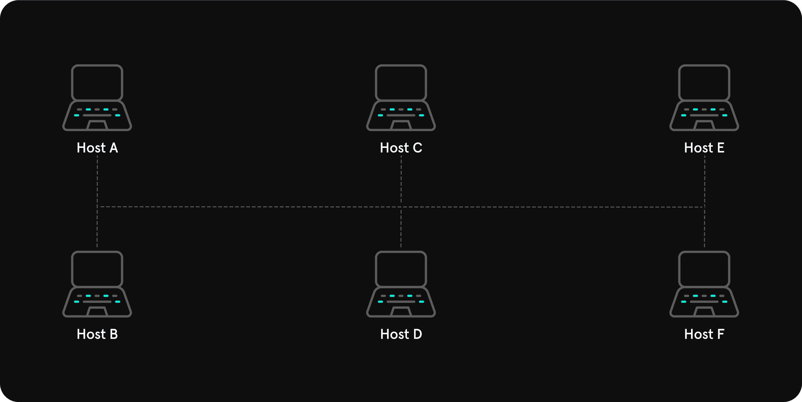
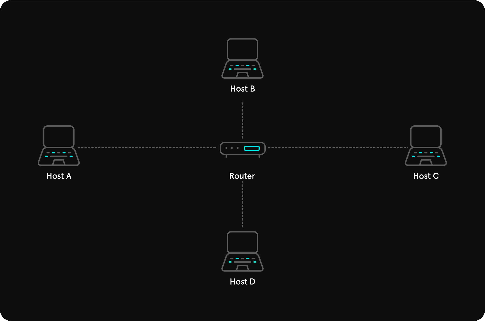
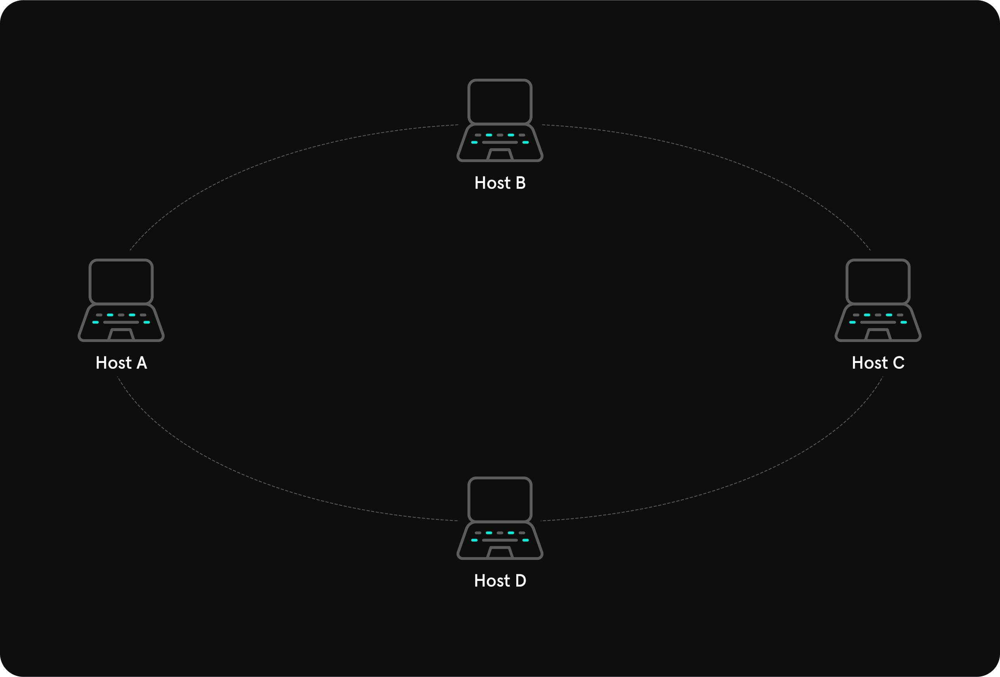
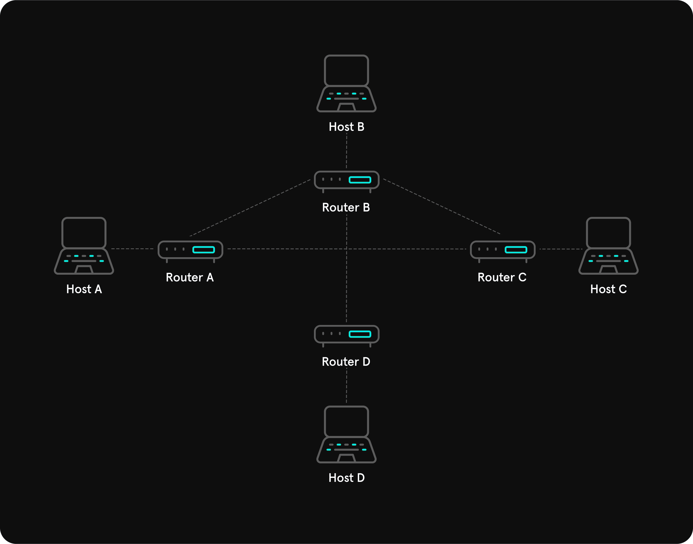
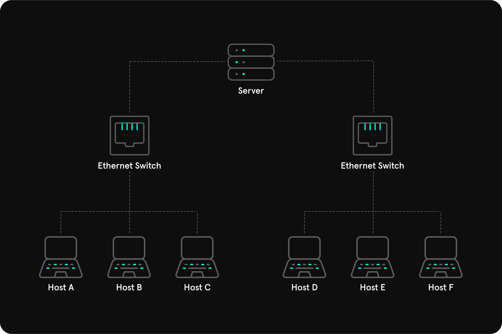
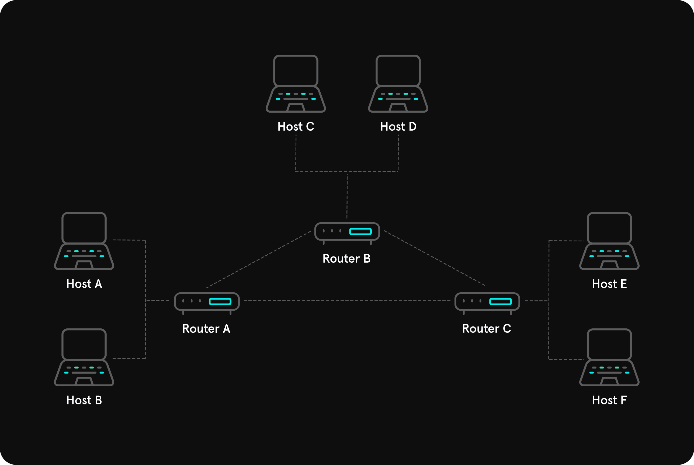

# Types / Topologies

## <mark style="color:yellow;">Network Types</mark>

### <mark style="color:blue;">WAN</mark>

<mark style="color:red;">**Wide Area Network**</mark> or commonly referred as <mark style="color:purple;">**The Internet**</mark>. WAN Address usually is <mark style="color:yellow;">**`IP Public Address + CIDR`**</mark>.

### <mark style="color:blue;">LAN / WLAN</mark>

Local Area Network and Wireless Local Area Network will usually assign IP addresses for private use, like <mark style="color:green;">`198.0.0.1/24`</mark>, <mark style="color:green;">`10.10.10.45/20`</mark>, <mark style="color:green;">`176.13.0.0/17`</mark> etc. Difference between **LAN** and **WLAN** is that **WLAN** can transmit data without cables, **LAN** is **cable-only**.

### <mark style="color:blue;">VPN</mark>

Main point of <mark style="color:red;">**Virtual Private Network**</mark> is simulate a work of Private Network, but virtually, **having perks of both sides**.

**Site-To-Site VPN**

<mark style="color:red;">**Site-to-site VPN**</mark> creates a <mark style="color:purple;">**secure connection between two separate networks located at different sites**</mark>, such as branch offices of a company or between a corporate office and a data center. It allows devices in these networks to communicate securely over the internet as if they were on the same local network.

**Remote Access VPN**

<mark style="color:red;">**Remote Access VPN**</mark> allows individual users to <mark style="color:purple;">**securely connect to a private network from a remote location over the internet**</mark>. It provides secure access to resources on the network, such as files, applications, or servers, as if the user were physically present in the organization's network. Good example of this is Vulnlab, HackTheBox and TryHackMe, because they are using +- same principle, OpenVPN for making a TUN adapter to get access to lab networks.

**SSL VPN**

<mark style="color:red;">**SSL VPN**</mark> operates similarly to a Remote Access VPN but specifically uses the <mark style="color:red;">**SSL/TLS**</mark>**&#x20;protocol** to secure the connection. It allows remote users to access private network resources securely over the internet, typically via a web browser or lightweight VPN client. Example could be a few CTF platform which requires to use web desktop application, or HTB Pwnbox (if you know, you know).

***

## <mark style="color:yellow;">Network Topologies</mark>

<mark style="color:red;">**Network Topologies**</mark> is typical <mark style="color:purple;">**arrangement of devices**</mark> like <mark style="color:blue;">**computers (clients or servers), bridges, switches and routers**</mark> in one. Also topologies can be <mark style="color:yellow;">**logical**</mark> and <mark style="color:yellow;">**physical**</mark>.&#x20;

Network Topologies can be separated into 3 areas:

1. <mark style="color:yellow;">**Connections**</mark> (wired or wireless, different cable types or Wifi, Cellular, Sattelite etc.)
2. <mark style="color:yellow;">**Nodes**</mark> (Repeaters, Routers, Hubs, Gateway, Bridges, Firewalls, Switches etc.)
3. <mark style="color:yellow;">**Classifications**</mark> (Point-To-Point, Bus, Star, Tree, Ring, Hybrid etc. )

## <mark style="color:yellow;">Network Classifications</mark>

### <mark style="color:blue;">Point-To-Point</mark>

<mark style="color:orange;">**Do not confuse it with P2P.**</mark> And besides that it's the simplest network topology because it <mark style="color:yellow;">**only connects 2 hosts**</mark>:&#x20;

<figure><figcaption>
Point-To-Point
</figcaption></figure>

### <mark style="color:blue;">Bus</mark>

<mark style="color:yellow;">**All hosts connected to transmission medium.**</mark> Also in this topology <mark style="color:yellow;">**only one host can send**</mark>, while other can only recieve data.

<figure><figcaption>
Bus
</figcaption></figure>

### <mark style="color:blue;">Star</mark>

All hosts are <mark style="color:yellow;">**connected to**</mark> <mark style="color:yellow;">**central network component**</mark> (switch, bridge or a hub) which is used for <mark style="color:yellow;">**packet**</mark> <mark style="color:yellow;">**forwarding**</mark>.

<figure><figcaption>
Star
</figcaption></figure>

### <mark style="color:blue;">Ring</mark>

Point of Ring topology is that it looks like a circle, and in each host there <mark style="color:yellow;">**cable for incoming and outcoming connections.**</mark>

<figure><figcaption>
Ring
</figcaption></figure>

### <mark style="color:blue;">Mesh</mark>

There is no certain structure in <mark style="color:red;">**Mesh**</mark> topology, but <mark style="color:yellow;">**there are 2 types: Fully-meshed and Partially-meshed networks.**</mark>&#x20;

In <mark style="color:purple;">**Fully-meshed networks**</mark> each host interconnected to each other. Also in this network type routers can be connected too, so if one router fails, other could work for both, what is making a network more stable.

In <mark style="color:purple;">**Partially-meshed**</mark> the endpoints are connected with only one connection, and some specific nodes can be connected to one or more nodes, depends on situation.

<figure><figcaption>
Mesh
</figcaption></figure>

### <mark style="color:blue;">Tree</mark>

<mark style="color:red;">**Tree**</mark> is an extented Star topology.

<figure><figcaption>
Tree
</figcaption></figure>

### <mark style="color:blue;">Hybrid</mark>

<mark style="color:red;">**Hybrid**</mark> topology is obviously a <mark style="color:yellow;">hybrid of different other topologies</mark>:

<figure><figcaption>
Hybrid
</figcaption></figure>

