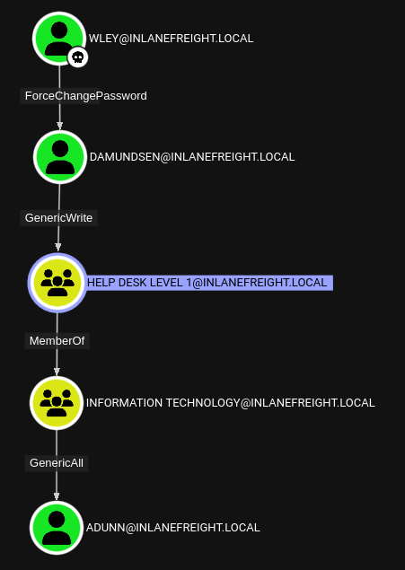

# BloodHound

## <mark style="color:yellow;">ABOUT</mark>

<mark style="color:red;">**BloodHound**</mark> is a powerful security tool that uses graph theory to reveal the relationships between users, groups, and computers in a domain [**\[LINK\]**](https://github.com/BloodHoundAD/BloodHound). Also it have companion tool <mark style="color:red;">**ShardHound**</mark> [**\[LINK\]**](https://github.com/BloodHoundAD/SharpHound)**.**

## <mark style="color:yellow;">INSTALL</mark>

I'm not SpecterOps, but for install guide you can look up here: [**\[LINK\]**](https://bloodhound.specterops.io/get-started/quickstart/community-edition-quickstart)

Then just go it directory tool installed BH (in my situation it's <mark style="color:green;">`/opt/Bloodhound`</mark>)

#### Turn On

```bash
docker compose up
```

#### Turn Off

```bash
docker compose stop
```

#### Check how much memory BH takes

```bash
docker system df
```

## <mark style="color:yellow;">USAGE</mark>

### <mark style="color:blue;">Access</mark>

After you composed, just go to <mark style="color:green;">`http://127.0.0.1:8080/ui/login`</mark> and use user <mark style="color:green;">`admin`</mark> and password which you should find at the first time boot up in output. Then change password ofc.&#x20;

### <mark style="color:blue;">Collectors</mark>

You can't use BloodHound if you don't have Collector's (SharpHound or AzureHound, depends on what you hacking) output - specific programs which collect all data user permissions allow, and pack it in a bunch of json files in zip archive.

You can install the newest version of SharpHound in <mark style="color:green;">`Download Collectors`</mark> field.&#x20;

<figure><figcaption><p>Download Collectors Field</p></figcaption></figure>

Then after you have SharpHound on your system, you should place it in targets system. How you would do it, it depends on you, but after SharpHound is inside, you can execute it with this command:&#x20;

```powershell
PS C:\> .\SharpHound.exe -c All --outputprefix 'SA1'
```

Then wait, and take your zip file back, and put it load it into BloodHound Session in <mark style="color:green;">`Administration -> Data Collection -> File Ingestion`</mark>.

> If you want to just test tool, you can download example zip file here: [**\[LINK\]**](https://github.com/user-attachments/files/17799530/ad_example_data.zip)

<figure><figcaption><p>File Ingest Field</p></figcaption></figure>

> Besides default collector, you can use two different tools to dump bloodhound externally

#### BloodHound-Python

> Useful script [**\[LINK\]**](https://github.com/dirkjanm/BloodHound.py/)

```bash
bloodhound-python -d arasaka.local -c All -u yorinobu.arasaka -p 'ihatesaburo' -ns 13.13.13.13 -k
```

#### <mark style="color:blue;">NetExec</mark>

```bash
nxc ldap 13.13.13.13 -u yorinobu.arasaka -p 'ihatesaburo' --bloodhound --collection All
```

### <mark style="color:blue;">Explore</mark>

So basically we have 3 fields: <mark style="color:red;">**Search**</mark>, <mark style="color:red;">**Pathfinding**</mark>, <mark style="color:red;">**Cypher:**</mark>

<figure><figcaption></figcaption></figure>

In **Search**, we can <mark style="color:purple;">**SEARCH for different objects in AD**</mark>, like users, ou, gpo, etc. We can specify type with tags like

* <mark style="color:green;">`gpo:`</mark>
* <mark style="color:green;">`user:`</mark>
* <mark style="color:green;">`domain:`</mark>

In <mark style="color:red;">**Pathfinding**</mark> (my favorite feature by now) you can <mark style="color:purple;">**make a path FROM -> TO objects**</mark>. As example I will be using domain from my HTB Academy learning where we was needed to find path from wley to adunn:

<figure><figcaption><p><a href="https://academy.hackthebox.com/"><strong>HTBA</strong></a></p></figcaption></figure>

So here we can see that if there is a chain of connections/accesses, it will automatically make a path.&#x20;

Also what is awesome, is that each **Edge Label** has more details and even references for more research and how you could abuse it from Linux or Windows, as example I will use DCSync label:

<figure><figcaption><p>Label Details</p></figcaption></figure>

In <mark style="color:red;">**Cypher**</mark> we can use custom, or pre-built searches, which can make <mark style="color:purple;">**search for certain info**</mark> easier.

<figure><figcaption><p>Cypher</p></figcaption></figure>

### <mark style="color:blue;">Group Management</mark>

In Group Management section we can check two <mark style="color:red;">**Groups**</mark>: <mark style="color:red;">**Owned**</mark> (skull logo) and <mark style="color:red;">**High Value**</mark> (diamond logo), environment and we can put a filters to check what, and how much of different objects we have, to later check them in <mark style="color:red;">**Explore**</mark>

### <mark style="color:blue;">**Administration**</mark>

Except <mark style="color:red;">**Ingest File**</mark> section (where we uploaded our SharpHound output), we can use <mark style="color:red;">**Data Quality**</mark>, where we can see list of objects we have:

<figure><figcaption><p>Data Quality</p></figcaption></figure>

And also we can delete our data (because if we imported data in BH, it's not deleted, even if we are closing the BH session) in <mark style="color:red;">**Database Management**</mark>:

<figure><figcaption><p>Database Management</p></figcaption></figure>

## <mark style="color:yellow;">INTERFACE</mark>

### <mark style="color:blue;">Labels</mark>

Yeah, we made a quick run on recon options, but there are also a few options which could customize our schemas, like <mark style="color:red;">**Hide Labels**</mark>, where there are two types of labels: <mark style="color:red;">**Edge**</mark> and <mark style="color:red;">**Node Label**</mark> where **Node Label** is label of **AD Object**, and **Edge Label** describing how nodes are connected with each other. Also with right click you can mark object as <mark style="color:red;">**Owned**</mark> (skull mark), if you pwned it.

<figure><figcaption><p>With both labels</p></figcaption></figure>

<figure><figcaption><p>Without Labels</p></figcaption></figure>

### <mark style="color:blue;">Layout</mark>

It's simple, there are two ways of layout: <mark style="color:red;">**Standart**</mark> and <mark style="color:red;">**Sequential**</mark>

> Layout of nodes isn't fixed, and you can move nodes with mouse as you want.

<figure><figcaption><p>Standard</p></figcaption></figure>

<figure><figcaption><p>Sequential</p></figcaption></figure>

### <mark style="color:blue;">Icons</mark>

As you seen, **BloodHound** has a bunch of icons, and I don't why, but I wanted to make a list of every icon and what it is (also design and color choices are PRETTY)

<figure><figcaption><p>User</p></figcaption></figure>

<figure><figcaption><p>Users</p></figcaption></figure>

<figure><figcaption><p>Computer</p></figcaption></figure>

<figure><figcaption><p>Domain</p></figcaption></figure>

<figure><figcaption><p>Organizational Unit</p></figcaption></figure>

<figure><figcaption><p>GPO</p></figcaption></figure>

<figure><figcaption><p>Container</p></figcaption></figure>

<figure><figcaption><p>Certificate Template</p></figcaption></figure>

## <mark style="color:yellow;">CUSTOM QUERIES</mark>

#### Check WinRM Access

```bash
MATCH p1=shortestPath((u1:User)-[r1:MemberOf*1..]->(g1:Group)) MATCH p2=(u1)-[:CanPSRemote*1..]->(c:Computer) RETURN p2
```

#### Check SQL Admin Access

```bash
MATCH p1=shortestPath((u1:User)-[r1:MemberOf*1..]->(g1:Group)) MATCH p2=(u1)-[:SQLAdmin*1..]->(c:Computer) RETURN p2
```

## <mark style="color:yellow;">RESOURCES</mark>








