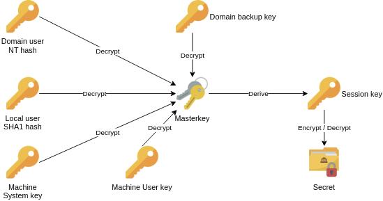

# SSRF

## <mark style="color:$primary;">ABOUT</mark>

Server-Side Request Forgery is a web security vulnerability that allows an attacker to cause the server-side application to make requests to an unintended location.

In a typical SSRF attack, the attacker might cause the server to make a connection to internal-only services within the organization's infrastructure. In other cases, they may be able to force the server to connect to arbitrary external systems. This could leak sensitive data, such as authorization credentials.


SSRF attacks often exploit trust relationships to escalate an attack from the vulnerable application and perform unauthorized actions. These trust relationships might exist in relation to the server, or in relation to other back-end systems within the same organization.


Why do applications behave in this way, and implicitly trust requests that come from the local machine? This can arise for various reasons:

* The access control check might be implemented in a different component that sits in front of the application server. When a connection is made back to the server, the check is bypassed.
* For disaster recovery purposes, the application might allow administrative access without logging in, to any user coming from the local machine. This provides a way for an administrator to recover the system if they lose their credentials. This assumes that only a fully trusted user would come directly from the server.
* The administrative interface might listen on a different port number to the main application, and might not be reachable directly by users.

These kind of trust relationships, where requests originating from the local machine are handled differently than ordinary requests, often make SSRF into a critical vulnerability.

## <mark style="color:$primary;">DEFENSE BYPASS</mark>

### <mark style="color:blue;">Blacklist</mark>

Some applications block input containing hostnames like 127.0.0.1 and localhost, or sensitive URLs like /admin. In this situation, you can often circumvent the filter using the following techniques:

* Use an alternative IP representation of **127.0.0.1**, such as **2130706433**, **017700000001**, or **127.1**.
* Register your own domain name that resolves to 127.0.0.1. You can use **spoofed.burpcollaborator.net** for this purpose.
* Obfuscate blocked strings using **URL encoding** or case variation.
* Provide a URL that you control, which redirects to the target URL. Try using different redirect codes, as well as different protocols for the target URL. For example, switching from an http: to https: URL during the redirect has been shown to bypass some anti-SSRF filters.

### <mark style="color:blue;">Whitelist</mark>

Whitelist-based SSRF defenses rely on string matching of the input URL against permitted domains (e.g. prefix, contains, or exact match checks on the hostname portion). The bypass techniques exploit systematic differences between the validation parser and the actual fetcher’s URL parsing and resolution logic.

#### Credentials prefix with @

```
http://stock.weliketoshop.net@127.0.0.1/admin
```

The validation layer identifies the permitted domain immediately preceding the last @ and considers it the effective host. The fetcher, adhering to RFC 3986, interprets everything after the final @ as the hostname and everything preceding it as userinfo (username:password). The permitted string is discarded as credentials, and the connection targets the attacker-controlled host placed after the @.

#### Fragment with \#

```
http://127.0.0.1/admin#stock.weliketoshop.net
```

Validation inspects the raw input string and detects the permitted domain substring, including portions after the # character. The fetcher discards the **fragment (#)** identifier and all subsequent content before DNS resolution or socket establishment, as fragments are client-side only. Only the attacker-supplied host preceding the # is processed.

#### Subdomain / DNS hierarchy

```
http://stock.weliketoshop.net.attacker-owned-domain.com/admin
```

Validation performs a substring or prefix match and accepts any hostname containing the permitted domain string. The attacker registers a domain and creates an A record mapping permitted-domain.attacker-controlled-domain to a private or loopback address (127.0.0.1, 10.x.x.x, etc.). The full hostname satisfies the string-based check, yet resolves to the restricted target via attacker-controlled DNS.

#### Encoding / double encoding

```
http://stock.weliketoshop.net%2523@127.0.0.1/admin
```

Validation either skips decoding, performs single-pass decoding, or mishandles recursive decoding. The fetcher typically applies full recursive percent-decoding per RFC. By encoding separators (. → %2e, @ → %40, # → %23) or double-encoding (%2523), the attacker conceals structural elements from validation while ensuring the fetcher reconstructs them (e.g. %2523 decodes first to %23, then to #). This restores credentials separators, fragments, or IP dots after validation but before or during request construction.

### <mark style="color:blue;">Open Redirect</mark>

When a direct SSRF payload is blocked by a strict whitelist (e.g. only URLs from weliketoshop.net are allowed), an open redirect on the same whitelisted domain can be used to bypass it.

The application first validates that the supplied URL belongs to a permitted domain and accepts it. The backend then makes an HTTP request to that URL. Because the chosen endpoint contains an open redirect vulnerability, the server follows the redirection to the attacker-controlled destination.

```
stockApi=http://weliketoshop.net/product/nextProduct?currentProductId=6&path=http://192.168.0.68/admin
```


To find such redirectors quickly, take a URL or API request from one part of the application and test it in another related section (especially within the same functionality). Many open redirects appear exactly this way.


## <mark style="color:$primary;">BLIND SSRF</mark>

Blind SSRF vulnerabilities occur when an application performs server-side requests based on user input but does not return the response to the attacker. Detection therefore relies on out-of-band (OAST) techniques that force the application to interact with an external system under the attacker’s control.

The most reliable method involves injecting a payload that causes the backend to initiate a network request to a domain the tester controls. Burp Collaborator is the standard tool for this purpose: it generates unique, random subdomains (e.g., `f7b9x2h4.oastify.com`). These domains are submitted in the vulnerable parameter. The tester then monitors the Collaborator server for incoming DNS lookups or HTTP requests originating from the target application. Any observed interaction confirms that the application made an outbound request, proving SSRF.

A frequent observation during testing is a DNS lookup recorded by Collaborator without a subsequent HTTP request. This occurs because many network infrastructures permit outbound DNS traffic (required for normal operation) while blocking unexpected HTTP connections to external hosts. The DNS resolution alone is still sufficient evidence of SSRF.

#### **Partial URLs**

In some cases the application does not accept a complete URL. Instead, only a hostname or path segment is placed into a request parameter and later concatenated server-side into a full URL. While the attack surface is obvious when the input is clearly treated as a hostname or path, full SSRF control is often limited because the attacker cannot influence the scheme, port, or other URL components.

#### **URLs Embedded in Data Formats**

Certain data formats permit the inclusion of URLs that are automatically requested during parsing. The most common example is XML: when an application accepts and parses XML input, embedded URLs may trigger server-side requests. This can manifest as SSRF through XXE (XML External Entity) injection, where an external entity definition forces the parser to fetch a remote resource. Such vectors expand the SSRF attack surface beyond conventional URL parameters.


In practice, blind SSRF testing begins with OAST payloads, progresses to partial URL injection when full URLs are rejected, and includes format-specific techniques (particularly XML) when structured data is accepted.


## <mark style="color:$primary;">EXAMPLES</mark>

<details>

<summary>Basic example </summary>

Here we are exploiting simple shop app, where it send request to API, which we can change to admin deletion page, because request is made from localhost.

<figure><figcaption></figcaption></figure>

</details>

<details>

<summary>Double URL filter bypass</summary>

<figure><figcaption></figcaption></figure>

</details>

<details>

<summary>Open Redirect filter bypass</summary>

<figure><figcaption></figcaption></figure>

</details>
