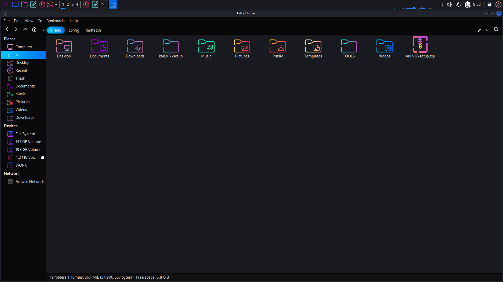
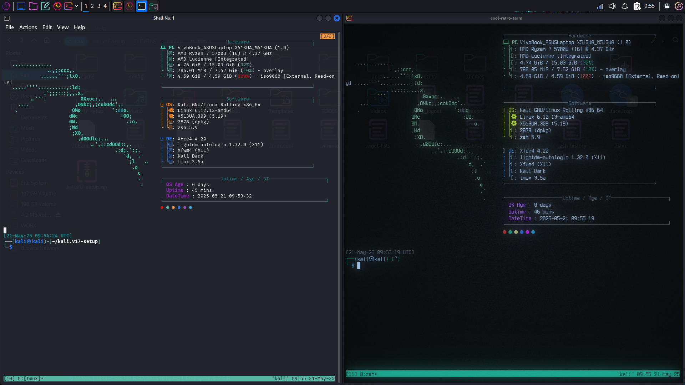

# c2V4eXRlcm1pbmFsdGhlbWU

## <mark style="color:yellow;">You have found me :3</mark>

<mark style="color:green;">⠀⠀⠀⠀⠀⠀⠀⢀⠀⠔⡀⠀⢀⠞⢰⠂⠀⠀⠀⠀⠀⠀⠀</mark>\ <mark style="color:green;">⠀⠀⠀⠀⠀⠀⠀⢸⠘⢰⡃⠔⠩⠤⠦⠤⢀⡀⠀⠀⠀⠀⠀</mark>\ <mark style="color:green;">⠀⠀⠀⢀⠄⢒⠒⠺⠆⠈⠀⠀⢐⣂⠤⠄⡀⠯⠕⣒⣒⡀⠀</mark>\ <mark style="color:green;">⠀⠀⢐⡡⠔⠁⠆⠀⠀⠀⠀⠀⢀⠠⠙⢆⠀⠈⢁⠋⠥⣀⣀</mark>\ <mark style="color:green;">⠈⠉⠀⣰⠀⠀⠀⠀⡀⠀⢰⣆⢠⠠⢡⡀⢂⣗⣖⢝⡎⠉⠀</mark>\ <mark style="color:green;">⢠⡴⠛⡇⠀⠐⠀⡄⣡⢇⠸⢸⢸⡇⠂⡝⠌⢷⢫⢮⡜⡀⠀</mark>\ <mark style="color:green;">⠀⠀⢰⣜⠘⡀⢡⠰⠳⣎⢂⣟⡎⠘⣬⡕⣈⣼⠢⠹⡟⠇⠀</mark>\ <mark style="color:green;">⠀⠠⢋⢿⢳⢼⣄⣆⣦⣱⣿⣿⣿⣷⠬⣿⣿⣿⣿⠑⠵⠀⠀</mark>\ <mark style="color:green;">⠀⠀⠀⡜⢩⣯⢝⡀⠁⠀⠙⠛⠛⠃⠀⠈⠛⠛⡿⠀⠀⠀⠀</mark>\ <mark style="color:green;">⠀⠀⠀⠀⠀⣿⠢⡁⠀⠀⠀⠀⠀⠀⠀⠀⠀⠀⡇⠀⠀⠀⠀</mark>\ <mark style="color:green;">⠀⠀⠀⠀⢀⣀⡇⠀⠑⠀⠀⠀⠀⠐⢄⠄⢀⡼⠃⠀⠀⠀⠀</mark>\ <mark style="color:green;">⠀⠀⠀⠀⢸⣿⣷⣤⣀⠈⠲⡤⣀⣀⠀⡰⠋⠀⠀⠀⠀⠀⠀</mark>\ <mark style="color:green;">⠀⠀⠀⠀⣼⣿⣿⣿⣿⣿⣶⣤⣙⣷⣅⡀⠀⠀⠀⠀⠀⠀⠀</mark>\ <mark style="color:green;">⠀⠀⢀⣾⣿⣿⣿⣿⣻⢿⣿⣿⣿⣿⣿⡿⠀⠀⠀⠀⠀⠀⠀</mark>\ <mark style="color:green;">⠀⡠⠟⠁⠙⠟⠛⠛⢿⣿⣾⣿⣿⣿⣿⣧⡀⠀</mark>⠀⠀

This is archive for my **Kali Theme + Setup**, as prize for mini-CTF.

This is _oneliner_ to install archive, use setup.sh script to install everything.&#x20;

> <mark style="color:orange;">**DISCLAIMER:**</mark>\ <mark style="color:orange;">If you afraid that this is virus or script will delete everything, you can just install it raw and check it yourself. But with oneliner it's easier.</mark>

```bash
wget -O kali.v17-setup.zip 'https://1512601210-files.gitbook.io/~/files/v0/b/gitbook-x-prod.appspot.com/o/spaces%2FxX3XegaS6tqwW9d8bpam%2Fuploads%2FXkWZ1rUYGb5nT3pQoimr%2Fkali.v17-setup.zip?alt=media&token=e4d55b8a-0889-4fc2-90e1-73f190dd5bf5' && unzip kali.v17-setup.zip && cd kali.v17-setup && chmod +x setup.sh && ./setup.sh
```

## <mark style="color:yellow;">SCRIPT</mark>



## <mark style="color:yellow;">IMAGES</mark>

<figure><figcaption><p>Desktop</p></figcaption></figure>

<figure><figcaption><p>Explorer</p></figcaption></figure>

<figure><figcaption><p>Terminals: Classic vs CRT</p></figcaption></figure>

## <mark style="color:yellow;">USAGE</mark>

So what this script installed is 4 things:

1. <mark style="color:green;">`cool-retro-term`</mark> is very cool terminal emulator. I use Futuristic theme (Manual setup)
2. <mark style="color:green;">`fastfetch`</mark> for kali symbol and OS Specifics output
3. <mark style="color:green;">`tmux`</mark> with all required configs for comfortable use
4. <mark style="color:green;">`sl`</mark> is for funny ASCII train

#### <mark style="color:blue;">TMUX</mark>

<mark style="color:red;">**TMUX**</mark> is tool that lets you <mark style="color:purple;">**manage multiple terminal sessions**</mark> within a single terminal window or remote SSH session. Setup script changed default shortcut from weird Ctrl+B to comfortable Ctrl+Space. All shortcuts I use (for more use this [**cheatsheet**](https://tmuxcheatsheet.com/)) is:

1. Create new Window : <mark style="color:green;">`Ctrl + Space C`</mark>
2. Switch Window : <mark style="color:green;">`Ctrl + Space 0...9`</mark>
3. Rename Window : <mark style="color:green;">`Ctrl + Space ,`</mark>
4. Move Window : <mark style="color:green;">`Ctrl + Space .`</mark>
5. List Windows : <mark style="color:green;">`Ctrl + Space W`</mark>
6. Create Horizontal Pane : <mark style="color:green;">`Ctrl + Space -`</mark>
7. Create Vertical Pane : <mark style="color:green;">`Ctrl + Space |`</mark>
8. Change Panes : <mark style="color:green;">`Ctrl + Space {Arrow Keys}`</mark>
9. Enter Command Mode: <mark style="color:green;">`Ctrl + Space :`</mark>

> Wallpapers are in /home/Pictures
>
> Tools are in /home/TOOLS

## <mark style="color:yellow;">KALI INSTALLATION</mark>

It's simple af, you just need 3 things: 10GB min USB, Kali Image, balenaEtcher (works for me the best)

1. Take your usb and put it in PC
2. Install **balenaEtcher** from [**\[LINK\]**](https://etcher.balena.io/)
3. Go to Kali website and choose [**Installer**](https://www.kali.org/get-kali/#kali-installer-images) Image (if you want instal Kali fully on your OS) or [**Live Boot**](https://www.kali.org/get-kali/#kali-live) (if you want to have it on USB)
4. Turn on Etcher, choose your USB, choose your image, wait and then go to BIOS, choose your USB and voila!
