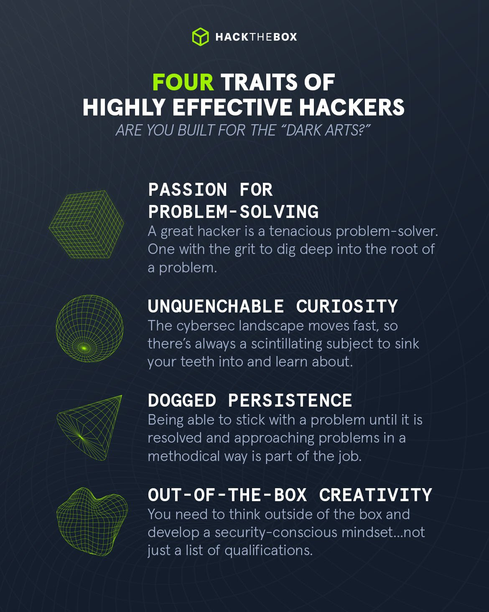

# Hacking Philosophy

## <mark style="color:yellow;">The Hacker Manifesto</mark>

<mark style="color:red;">**Loyd Blankenship**</mark> had been involved with several prominent hacker groups in the early 1980s, including the **Legion of Doom (LoD)**. In 1986, after his arrest for unauthorized computer access, he wrote the manifesto in a burst of emotion — more as a personal reflection than a call to action.

For me it's perfect representation of hacking culture, especially then, when it was more punk-like.

```armasm
                               ==Phrack Inc.==

                    Volume One, Issue 7, Phile 3 of 10

=-=-=-=-=-=-=-=-=-=-=-=-=-=-=-=-=-=-=-=-=-=-=-=-=-=-=-=-=-=-=-=-=-=-=-=-=-=-=-=
The following was written shortly after my arrest...

                       \/\The Conscience of a Hacker/\/

                                      by

                               +++The Mentor+++

                          Written on January 8, 1986
=-=-=-=-=-=-=-=-=-=-=-=-=-=-=-=-=-=-=-=-=-=-=-=-=-=-=-=-=-=-=-=-=-=-=-=-=-=-=-=

        Another one got caught today, it's all over the papers.  "Teenager
Arrested in Computer Crime Scandal", "Hacker Arrested after Bank Tampering"...
        Damn kids.  They're all alike.

        But did you, in your three-piece psychology and 1950's technobrain,
ever take a look behind the eyes of the hacker?  Did you ever wonder what
made him tick, what forces shaped him, what may have molded him?
        I am a hacker, enter my world...
        Mine is a world that begins with school... I'm smarter than most of
the other kids, this crap they teach us bores me...
        Damn underachiever.  They're all alike.

        I'm in junior high or high school.  I've listened to teachers explain
for the fifteenth time how to reduce a fraction.  I understand it.  "No, Ms.
Smith, I didn't show my work.  I did it in my head..."
        Damn kid.  Probably copied it.  They're all alike.

        I made a discovery today.  I found a computer.  Wait a second, this is
cool.  It does what I want it to.  If it makes a mistake, it's because I
screwed it up.  Not because it doesn't like me...
                Or feels threatened by me...
                Or thinks I'm a smart ass...
                Or doesn't like teaching and shouldn't be here...
        Damn kid.  All he does is play games.  They're all alike.

        And then it happened... a door opened to a world... rushing through
the phone line like heroin through an addict's veins, an electronic pulse is
sent out, a refuge from the day-to-day incompetencies is sought... a board is
found.
        "This is it... this is where I belong..."
        I know everyone here... even if I've never met them, never talked to
them, may never hear from them again... I know you all...
        Damn kid.  Tying up the phone line again.  They're all alike...

        You bet your ass we're all alike... we've been spoon-fed baby food at
school when we hungered for steak... the bits of meat that you did let slip
through were pre-chewed and tasteless.  We've been dominated by sadists, or
ignored by the apathetic.  The few that had something to teach found us will-
ing pupils, but those few are like drops of water in the desert.

        This is our world now... the world of the electron and the switch, the
beauty of the baud.  We make use of a service already existing without paying
for what could be dirt-cheap if it wasn't run by profiteering gluttons, and
you call us criminals.  We explore... and you call us criminals.  We seek
after knowledge... and you call us criminals.  We exist without skin color,
without nationality, without religious bias... and you call us criminals.
You build atomic bombs, you wage wars, you murder, cheat, and lie to us
and try to make us believe it's for our own good, yet we're the criminals.

        Yes, I am a criminal.  My crime is that of curiosity.  My crime is
that of judging people by what they say and think, not what they look like.
My crime is that of outsmarting you, something that you will never forgive me
for.

        I am a hacker, and this is my manifesto.  You may stop this individual,
but you can't stop us all... after all, we're all alike.

                               +++The Mentor+++
_______________________________________________________________________________
```

## <mark style="color:yellow;">Motto</mark>

My personal motto is <mark style="color:orange;">**"Quo Non Ascendam"**</mark>, which is&#x20;

> To what heights can I not rise?

Which in easier words is just _"What limits can truly contain me?". Which symbolizes_&#x20;

* Unbounded curiosity
* Defiance of imposed limits
* Relentless drive to explore, understand, and control systems

## <mark style="color:yellow;">How to Become Hacker</mark>

To clarify from beginning, I am also working on to becoming a hacker _(no job = no title I think)_, but I am learning for more than 3 years slowly and not, so I was boiling in this culture for quite some time. So basically if you think about hacking as a career, you need to view your past life and think about whether you have these 4 traits

* <mark style="color:orange;">**Passion for Problem-Solving**</mark>
* <mark style="color:orange;">**Unquenchable Curiosity**</mark>
* <mark style="color:orange;">**Dogged Persistence**</mark>Forge your own path
* <mark style="color:orange;">**Out-Of-The-Box Thinking**</mark>

<figure><figcaption><p>Image from HTB Blog</p></figcaption></figure>

If you don't have more than one, then think more about if you really want to spend a LOT time, and insane amount of effort to get into field, and actually get a job in cyber, ESPECIALLY in offensive side of it.&#x20;

But if you are, and think you could be the one who will go to the end, then I recommend to <mark style="color:orange;">**start in TryHackMe**</mark>, that's an insanely good platform from absolute zero knowledge, where you can spend basically good year or more of learning. Also it's pretty cheap and has a lot of free rooms.

Then I would recommend to <mark style="color:orange;">**begin to learn in HackTheBox Academy**</mark>, because comparing to other platforms, it has modules _(principle of learning which is basically books + practice)_ with insane quality of materials. Also **CBBH** and **CPTS** are relatively cheap, same thing with certificates, which would help you test your skills and will increase chance of getting a job.&#x20;

Important part is <mark style="color:orange;">**combining theory with practice**</mark>, because hacking is all about <mark style="color:orange;">**learning + doing**</mark>, so by doing some easy challenges in **TryHackMe** once or twice in a week you will retain interest in the topic, because no matter what the theory is, it is easy to overlap it. When you're knowledge will become broader, you can try crack some active machines on **HTB**

Also what kickstarted my learning 3 years ago is team. I was looking for fellas in CTFTime,  some russian CTF team allowed me to join them, where members recommended me TryHackMe and HackTheBox.

> Before that I was doing lame courses and cringe YouTube videos on "How to become Hacker in 1 hour", so you can guess that I didn't learnt a lot then ;)

But after Full-Scaled Invasion on Ukraine, I burned the bridges with them, and then after some time after sending requests to all HTB Teams with cool logos and names, [**purplestorm**](https://discord.gg/7cvGy7ED) ended up taking me in, and I am infinitely grateful to it, and especially our captain - [<mark style="color:purple;">**`syr0`**</mark>](https://github.com/0xsyr0) _(you may have seen his awesome handbooks repository)_, because he helped me quite a lot on making me forge my own path, so basically thanks to my Mentor.&#x20;

So the point is - <mark style="color:orange;">**find a team**</mark>, some Discord servers (as example of purplestorm server, or THM's with HTB's) or guys to hang out with, because hacking is super niche topic, not a lot of programmers or regular IT guys would truly understand what you do, and that's why hacking is a lonely road — be ready that nobody would be interested in your craft as much as you do, and not so much people would understand what do you actually **DO.** And that's why <mark style="color:orange;">**it's important to find team, community, and someone who you can learn from**</mark>. That's more funny and more effective:&#x20;

> If you want to learn piano, go to pianist. If you want to learn art, go to artist. If you want to learn hacking, ask hackers. Want to learn some craft, go to Craftmaster.

And the last one important thing, which almost denies all my yap here, but:

**Forge your own path**, this is how I learnt what I know and what you can see here, in this project, but you are different, so just <mark style="color:orange;">**Learn, Adapt, Advance**</mark>. Don't listen to anybody fully, and do what you want. Only with persistence of Sisyphus you can become master.&#x20;

## <mark style="color:yellow;">Media</mark>

That's not important at all, but if you want to get more into hacking as culture, you can try watch these movies, and play these games.

#### [Hackers (1995)](https://www.imdb.com/title/tt0113243/)

Awesome old-school movie about hacking culture.

***

[**Whoami (2014)**](https://www.imdb.com/title/tt3042408/)

Stylish German movie about hacking, which reminds me of Fight Club

***

[**Mr. Robot (2015-2017)**](https://www.imdb.com/title/tt4158110/)

My favorite series of all time, actors, music, story, themes, directing — **everything is pure perfection**.

***

[**Watch\_Dogs**](https://store.steampowered.com/curator/44541400)

Very good series of games, the most popular games about hackers. Fan of two first games, third was mid

First game is techno-thriller with Open-World Third-Person Shooter gameplay, which would make you feel like John Wick Hacker.

Second game is more fun, have more creative deep gameplay, and the vibe reminds me the Hackers (1995) movie, when it wasn't about gritty black hoodie criminals, but about geeks who's smart, rebellious and ambitious _(which as I think represent hacking culture perfectly)_

***

[**Deus Ex Human Revolution**](https://store.steampowered.com/app/238010/Deus_Ex_Human_Revolution__Directors_Cut/)

[**Deus Ex Mankind Divided**](https://store.steampowered.com/app/238010/Deus_Ex_Human_Revolution__Directors_Cut/)&#x20;

[**Dishonored**](https://store.steampowered.com/sub/31293/)

[**Dishonored 2**](https://store.steampowered.com/app/403640/Dishonored_2/)

[**Prey (2017)**](https://store.steampowered.com/app/480490/Prey/)

[**Weird West**](https://store.steampowered.com/app/480490/Prey/)

For all these games I can say almost same things in terms of how they are good for you as potential hacker, and these reasons is genre — [**Immersive Sim**](https://en.wikipedia.org/wiki/Immersive_sim). Genre that could train challenge your out-of-the-box thinking _(Prey is especially good at that point)_. If you don't know where to start, it's simple

**Love Westerns and Mysticism - Weird West**

**Love Dark-Steampunk - Dishonored**

**Love Sci-Fi and Alien - Prey**&#x20;

**Love Cyberpunk - Deus Ex**

***

[**Hitman**](https://store.steampowered.com/franchise/hitman) **and** [**Splinter Cell**](https://store.steampowered.com/bundle/23545/Splinter_Cell_Franchise/) **Series**

Both are very good stealth games, which are practicing creative thinking and stealth planning, which is required for our job. Splinter Cell is good for grounded stealth missions as secret agent _(I know that MGS is good, but I've never played it by now, so can't recommend)_, and Hitman is good for social engineering skills with creativity, which is also required for job.

***

[**Portal 1 & 2**](https://store.steampowered.com/developer/valve/list/9/)**,** [**Talos Principle 1 & 2**](https://store.steampowered.com/sale/thetalosprinciple)

Here everything is simple, these are the best puzzles in industry, which is good for brain which is good for hacks.

***

[**Hacknet**](https://store.steampowered.com/app/365450/Hacknet/)

This is the best hacking sim, it will teach you basic terms, even a little linux commands
